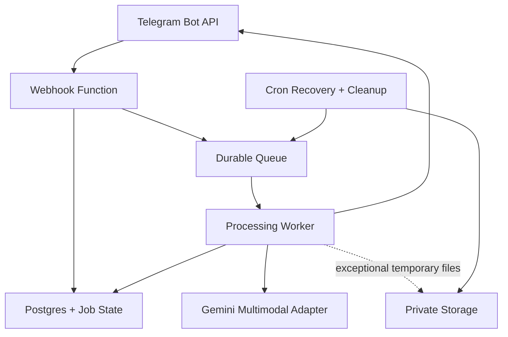
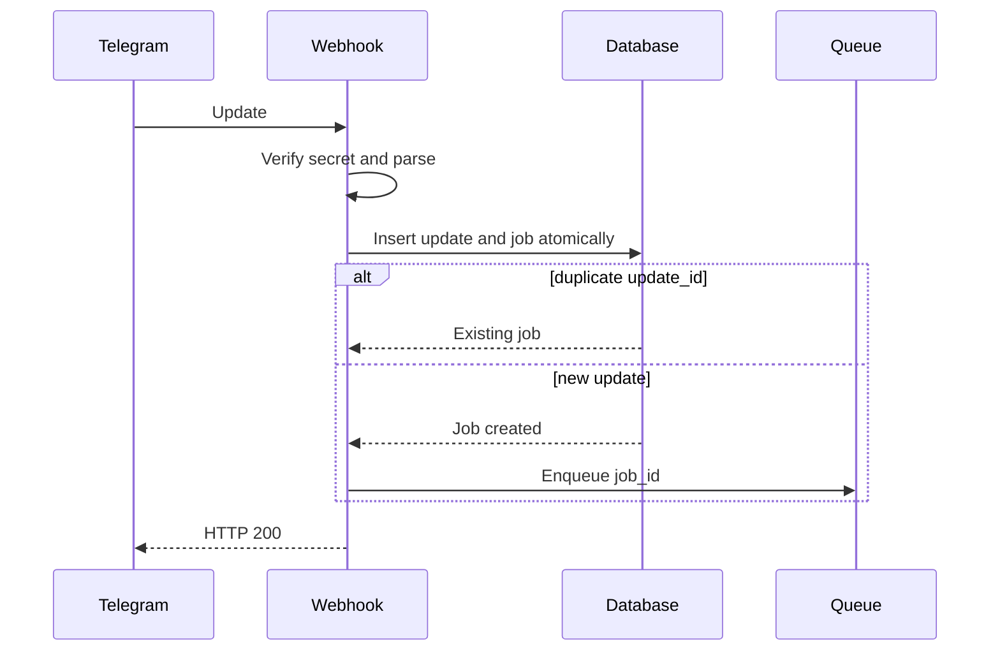
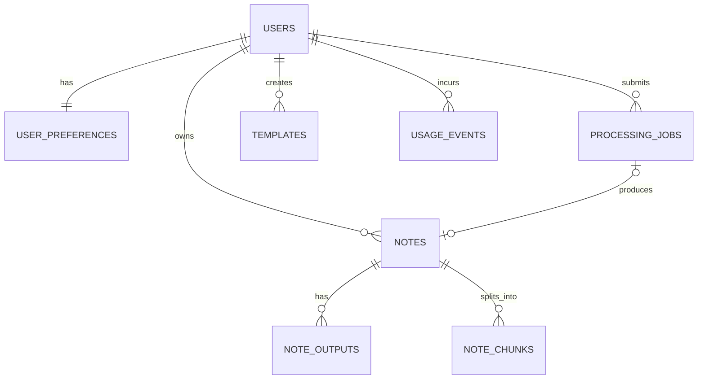
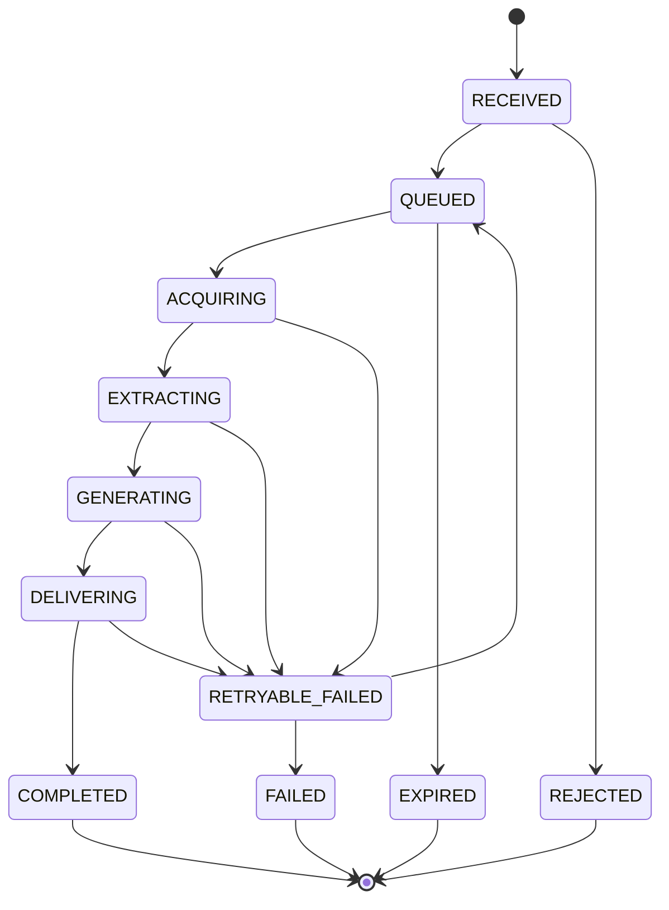

# Notinn

## Master Product Blueprint and Technical Architecture

| Field             | Value                                                   |
| ----------------- | ------------------------------------------------------- |
| Product name      | Notinn                                                  |
| Document version  | 0.2                                                     |
| Status            | Architecture baseline for discussion and implementation |
| Primary interface | Telegram private chat                                   |
| Backend           | Supabase                                                |
| Primary language  | TypeScript                                              |
| Last updated      | 16 September 2026                                       |

---

## 1. Executive Summary

Notinn is a Telegram-first SaaS that converts unstructured information into useful, searchable, and reusable notes. A user can paste messy text, record a voice note, forward messages, send a screenshot, or upload a document. The bot extracts the content, applies a selected note format, returns a structured result, and optionally saves the result to the user's personal note library.

The product is not positioned as a generic summarizer. Its intended product category is:

> A conversational knowledge inbox that turns anything sent through Telegram into structured notes that can be found and reused later.

The initial product has no standalone web or mobile application. Telegram is the capture and interaction interface. Supabase provides the database, Edge Functions, durable processing state, queues, scheduled cleanup, and optional temporary object storage. One Gemini Flash model handles text transformation, audio transcription, image understanding, PDF understanding, and structured note generation. A provider abstraction is retained so another model can be introduced later without changing domain logic, but the MVP uses only one AI provider and one AI API key.

Raw files are not retained by default. For ordinary Telegram files, the backend temporarily retrieves the file from Telegram, sends it to the relevant AI provider, stores only approved derived content, and discards the binary. Supabase Storage is used only when temporary conversion or provider access requires it. Any temporary object must be deleted immediately after processing, with an orphan cleanup deadline of no more than 60 minutes.

---

## 2. Product Vision

### 2.1 Vision statement

Enable people to capture information in the most convenient place they already use, then turn that information into organized knowledge without manually rewriting, categorizing, or moving it between applications.

### 2.2 Core promise

The user should be able to send almost any everyday information to one Telegram bot and receive a reliable, well-structured note within a few moments.

### 2.3 Product positioning

The product combines three capabilities:

1. **Universal capture:** text, forwarded messages, voice, screenshots, photos, and documents.
2. **Intelligent transformation:** cleanup, transcription, extraction, summarization, and structured templates.
3. **Personal knowledge retrieval:** recent notes, keyword search, semantic search, and questions over saved notes.

### 2.4 Primary target users

The initial broad target is Indonesian knowledge workers, students, and independent professionals who already use Telegram and frequently receive or create information in an unstructured form.

Early validation should prioritize users who regularly:

- Record personal voice notes after meetings.
- Copy long messages from group chats.
- Receive PDF documents that need quick understanding.
- Capture screenshots of useful information.
- Need meeting minutes, action items, research notes, or concise briefs.

### 2.5 Jobs to be done

- “When I have an idea while moving, I want to speak it into Telegram and get a clean note.”
- “When I receive a long message, I want the important information without manually reorganizing it.”
- “When I finish a meeting, I want decisions and action items extracted from my recording.”
- “When I receive a document, I want a usable summary with important uncertainties and references.”
- “When I need information again, I want to find the relevant note by asking naturally.”

---

## 3. Product Principles

1. **Capture must be effortless.** Sending content should be sufficient. Commands and configuration are secondary.
2. **Useful by default.** The bot generates a sensible default result before asking the user to make multiple choices.
3. **AI transforms; deterministic services control.** Model outputs are validated before persistence or rendering.
4. **Original content is never silently overwritten.** Generated variants are versions or outputs, not destructive edits.
5. **Raw-file minimization.** Binary input is not retained unless technically required or explicitly requested.
6. **Derived data is still sensitive.** Transcripts and extracted text receive the same access controls as original files.
7. **Uncertainty must be visible.** Unclear audio, unreadable text, and unsupported layouts are disclosed.
8. **One user can never access another user's notes.** Every record is scoped by an immutable internal user ID.
9. **Fast acknowledgement, asynchronous completion.** Telegram webhooks return quickly; heavy work runs through a durable job system.
10. **One-model MVP, replaceable architecture.** Gemini Flash is the only MVP model, but it remains behind an adapter rather than becoming domain logic.
11. **Deletion is a product feature.** Users can delete a note and its derived data, not merely hide it.
12. **Minimal conversational friction.** Inline actions are preferred to long command menus and multi-step wizards.

---

## 4. Goals and Non-Goals

### 4.1 MVP goals

- Receive private Telegram messages safely.
- Support messy text, forwarded text, voice notes, audio, screenshots/photos, PDF, DOCX, TXT, and Markdown.
- Produce clean notes, summaries, key points, action items, and meeting notes.
- Allow one-tap format changes without requiring a new upload.
- Save, list, retrieve, regenerate, and delete notes.
- Support Indonesian and English input.
- Mirror the source language by default, with a configurable output language.
- Implement durable processing, retries, deduplication, rate limiting, and usage metering.
- Avoid persistent raw-file storage by default.
- Establish a data model that can later support a web dashboard and billing.

### 4.2 Explicit MVP non-goals

- Public groups, channels, or group collaboration.
- Real-time multi-user document editing.
- A web or mobile client.
- Permanent original-file archive.
- Video summarization.
- Spreadsheet analysis.
- Autonomous task execution in external apps.
- Team workspaces, organization roles, and shared note libraries.
- Full Notion, Google Drive, or Todoist synchronization.
- Fine-tuning proprietary models.
- Medical, legal, or financial professional advice.

---

## 5. Supported Inputs

| Input                   | MVP support     | Processing route                                          | Important limitation                                 |
| ----------------------- | --------------- | --------------------------------------------------------- | ---------------------------------------------------- |
| Plain text              | Yes             | Text cleanup/generation                                   | Configurable maximum characters                      |
| Forwarded Telegram text | Yes             | Text cleanup/generation                                   | Forward metadata is not trusted as identity evidence |
| Telegram voice note     | Yes             | Gemini audio understanding → transcript + structured note | Product duration and Telegram file-size limits apply |
| Audio file              | Yes             | Gemini audio understanding → transcript + structured note | Supported audio codecs only                          |
| Screenshot/photo        | Yes             | Gemini vision/OCR → structured note                       | Blurry or rotated content can reduce accuracy        |
| PDF                     | Yes             | Gemini document understanding → structured note           | Encrypted/corrupted PDFs are rejected                |
| DOCX                    | Yes, text-first | Safe extraction of paragraphs and tables                  | Visual layout may not be fully preserved             |
| TXT/Markdown            | Yes             | Safe text extraction                                      | Encoding must be validated                           |
| PPTX                    | Later           | Slide extraction/vision                                   | Not in MVP                                           |
| URL/article             | Later           | Secure fetch and content extraction                       | SSRF and paywall controls required                   |
| Video                   | No              | —                                                         | Explicitly out of scope                              |
| Spreadsheet             | No              | —                                                         | Explicitly out of scope                              |

### 5.1 Initial configurable product limits

These are product safeguards, not provider maxima, and must be centrally configurable:

- Telegram file: maximum 20 MB.
- Pasted text: maximum 60,000 characters.
- Voice/audio: maximum 30 minutes during alpha.
- PDF: maximum 100 pages during alpha.
- Image batch: one image per MVP job.
- DOCX extracted text: maximum 100,000 characters before chunking.
- Maximum retry attempts: three.

Limits may later differ by subscription plan.

---

## 6. Output Formats

### 6.1 System templates

| Template         | Intended result                                                   |
| ---------------- | ----------------------------------------------------------------- |
| Clean Note       | Corrected, structured version without unnecessary compression     |
| Short Summary    | A concise TL;DR and a few key points                              |
| Detailed Summary | Sectioned summary preserving major context                        |
| Key Points       | Bulleted facts and ideas only                                     |
| Action Items     | Tasks, owners, and deadlines when present                         |
| Meeting Notes    | Agenda/context, discussion, decisions, and action items           |
| Study Notes      | Concepts, explanations, examples, and review questions            |
| Decision Log     | Decision, rationale, alternatives, owner, and date                |
| SOP / Procedure  | Objective, prerequisites, ordered steps, and warnings             |
| Research Note    | Research question, findings, evidence, limitations, and follow-up |

### 6.2 Custom templates

Custom templates are a post-MVP or Pro feature. A custom template defines:

- Name and description.
- Applicable input types.
- Required and optional sections.
- Output language and verbosity.
- JSON output schema.
- Rendering instructions.

User-provided instructions are treated as configuration data and cannot override security, privacy, or platform rules.

### 6.3 Default template routing

| Input             | Default                                             |
| ----------------- | --------------------------------------------------- |
| Pasted text       | Clean Note                                          |
| Forwarded message | Short Summary                                       |
| Voice note/audio  | Meeting Notes if meeting-like, otherwise Clean Note |
| Screenshot/photo  | Extract & Summarize                                 |
| PDF/DOCX          | Detailed Summary                                    |

The result always includes alternative-format inline buttons so the user can change the output without re-uploading.

---

## 7. Conversational Experience

### 7.1 Core interaction pattern

1. User sends content.
2. Bot acknowledges receipt within the webhook response path.
3. Bot creates or edits one status message.
4. Processing continues asynchronously.
5. Bot edits the status message or sends the completed note.
6. Inline actions allow save, format change, retry, export, or deletion.

### 7.2 Example: voice note

```text
User:
[8-minute voice note]

Bot:
Processing your voice note…

Bot:
Weekly Risk Review

TL;DR
The team agreed to complete the control-evidence review before Friday.

Key points
• Three control gaps require supporting evidence.
• The billing process map requires revision.
• Data owners must confirm their submissions.

Action items
• Revise the process map — Friday
• Provide invoice samples — Thursday

[Save] [Full transcript]
[Shorter] [Detailed] [Meeting notes]
[Delete]
```

### 7.3 Example: messy text

```text
User:
besok ketemu vendor jam 10 bahas proposal baru terus tanyain revisi harga sama timeline implementasi mungkin bawa tim legal juga

Bot:
Vendor Meeting Preparation

Schedule
Tomorrow at 10:00

Discussion points
• New proposal
• Revised pricing
• Implementation timeline
• Whether the legal team should attend

[Save] [Action items] [Keep original wording]
```

### 7.4 Commands

Commands are shortcuts, not the primary UX:

- `/start` — onboarding and privacy summary.
- `/help` — supported inputs and actions.
- `/recent` — recent saved notes.
- `/search` — start a note search.
- `/templates` — template selection and defaults.
- `/settings` — language, retention, and behavior.
- `/usage` — current plan usage.
- `/privacy` — data handling and deletion policy.
- `/delete_account` — initiate account deletion with confirmation.

### 7.5 Required inline actions

- Save / Unsave.
- Shorter.
- More detailed.
- Change format.
- Show transcript/extracted text.
- Retry.
- Report issue.
- Delete note.

Callback payloads must contain opaque IDs, not raw prompts, filenames, or note content.

---

## 8. Functional Requirements

### 8.1 User onboarding

- Create one user record on the first private message.
- Do not require a separate email or password for Telegram-only use.
- Show concise privacy and AI-processing disclosure.
- Store Telegram username and display name only when needed; treat them as changeable metadata.
- Use `telegram_user_id` for identity mapping, never username.
- Reject non-private chats during MVP with a concise explanation.

### 8.2 Content ingestion

- Detect input type deterministically from the Telegram update.
- Validate file size before download when Telegram provides it.
- Validate MIME type, extension, and magic bytes when binary content is fetched.
- Deduplicate Telegram updates using `update_id`.
- Deduplicate accidental repeated files using `file_unique_id` plus a short user-scoped time window, but never silently suppress an intentional repeat.
- Return HTTP 200 quickly after durable receipt.

### 8.3 Processing

- Route input to the correct extractor/transcriber.
- Separate extraction from note generation.
- Validate all AI structured output against a schema.
- Retry only retryable failures.
- Never retry validation or unsupported-format failures indefinitely.
- Record provider, model, latency, and token/minute usage without logging raw user content.
- Preserve explicit uncertainty markers.

### 8.4 Note management

- Save completed outputs only after successful schema validation.
- Support multiple generated outputs from the same normalized source.
- Allow one output to be marked as the current preferred version.
- List notes by most recent update.
- Search by title, tags, and content.
- Delete note, derived outputs, chunks, and embeddings together.
- Keep a minimal non-content deletion audit record where legally and operationally appropriate.

### 8.5 Search and retrieval

- Phase 1: full-text and metadata search.
- Later: semantic search using embeddings.
- Always scope queries by internal `user_id`.
- Provide source note titles and dates in cross-note answers.
- Do not claim access to content outside the retrieved notes.

### 8.6 Usage metering

- Record one immutable usage event for each provider operation.
- Meter text input/output tokens, audio seconds, document pages, storage bytes, and function jobs.
- Enforce limits before starting expensive processing.
- Do not rely only on provider dashboards for user-level usage.

---

## 9. System Architecture

### 9.1 Recommended stack

| Layer                                  | Technology                                               |
| -------------------------------------- | -------------------------------------------------------- |
| User interface                         | Telegram Bot API, private chat                           |
| Bot framework                          | grammY or a thin typed Telegram client                   |
| Runtime                                | Supabase Edge Functions, TypeScript/Deno                 |
| Database                               | Supabase PostgreSQL                                      |
| Durable jobs                           | Supabase Queues / `pgmq` plus processing job table       |
| Scheduling                             | Supabase Cron / `pg_cron`                                |
| Temporary objects                      | Private Supabase Storage bucket, exceptional use only    |
| AI model                               | One configurable Gemini Flash model                      |
| Text, audio, image, and PDF processing | Gemini multimodal adapter                                |
| DOCX/TXT/Markdown extraction           | Deterministic safe parser before Gemini                  |
| Validation                             | Zod-compatible runtime schemas                           |
| Semantic search                        | PostgreSQL full-text first; `pgvector` later             |
| Observability                          | Structured logs, database metrics, provider usage events |
| Development                            | VS Code, Claude Code, Supabase CLI, Deno tests           |

### 9.2 Logical architecture



### 9.3 Responsibility boundaries

#### Telegram transport

- Parse updates.
- Validate webhook origin.
- Extract Telegram identifiers and file metadata.
- Send/edit messages and answer callback queries.
- Contain no summarization or persistence logic.

#### Application services

- Onboarding.
- Input routing.
- Note creation and versioning.
- Template selection.
- Search.
- Usage enforcement.
- Deletion orchestration.

#### Processing services

- File retrieval.
- Safe extraction.
- Transcription.
- AI generation.
- Structured-output validation.
- Retry classification.

#### Persistence repositories

- Database access through narrow repositories.
- User scoping enforced in every method.
- No Telegram or AI-provider calls.

#### Provider adapters

- Translate internal requests to provider-specific APIs.
- Normalize provider responses and usage metadata.
- Enforce timeouts and output limits.
- Never write application tables directly.

---

## 10. End-to-End Processing Flows

### 10.1 Common webhook flow



The webhook must not wait for transcription, OCR, PDF processing, or note generation.

### 10.2 Text flow

1. Normalize line endings and Unicode.
2. Reject empty or oversized input.
3. Detect language.
4. Select default or requested template.
5. Generate structured note JSON.
6. Validate output.
7. Persist source text and output according to user retention settings.
8. Send formatted Telegram result.

### 10.3 Voice/audio flow

1. Read `telegram_file_id`, MIME type, duration, and size.
2. Call Telegram `getFile` from the worker.
3. Fetch binary privately; never expose the Telegram file URL to the AI provider because it contains the bot token.
4. Send inline audio to Gemini with one structured-output schema that requests the transcript and selected note format together.
5. Validate the transcript, structured note, detected language, timestamps, and uncertainty fields.
6. Discard the binary immediately after the Gemini request completes.
7. Persist the transcript only according to user settings.
8. Clear `telegram_file_id` after the job reaches a terminal state unless a short retry window is intentionally configured.

If processing fails, a retry normally re-fetches the file from Telegram. If the file is unavailable, ask the user to resend it.

### 10.4 Screenshot/photo flow

1. Select the highest suitable Telegram photo resolution within limits.
2. Fetch to memory.
3. Validate actual image type and dimensions.
4. Send inline image data to Gemini.
5. Request extracted text, structured note output, and uncertainty markers in one call.
6. Discard binary.
7. Validate and persist the note.

### 10.5 PDF flow

1. Validate size, PDF signature, encryption status, and page count where possible.
2. Fetch to memory.
3. Prefer inline Gemini input for files within the Telegram limit to avoid unnecessary file persistence.
4. Request one structured response containing normalized content, summary, key points, page references, and uncertainty.
5. Discard binary.
6. Save derived text/output according to user policy.

### 10.6 DOCX flow

1. Reject macro-enabled documents during MVP.
2. Validate ZIP structure and decompression ratio to reduce ZIP-bomb risk.
3. Extract paragraphs, headings, lists, and tables using a safe library.
4. Do not execute macros, embedded scripts, or external resources.
5. Generate a note from the extracted representation.
6. If layout-aware conversion is later required, use temporary storage and delete the artifact immediately in a `finally` path.

### 10.7 Format regeneration

1. User selects an alternative template.
2. Retrieve normalized source text, transcript, or extracted content.
3. Do not re-fetch or re-transcribe the raw file unless strictly necessary.
4. Generate a new `note_output` version.
5. Mark it current only after successful validation and delivery.

---

## 11. Raw-File and Data-Retention Architecture

### 11.1 Default raw-file policy

> The application does not persist original binary input by default.

Ordinary processing uses in-memory or streamed binary data. A raw file is discarded whether processing succeeds or fails. Retry obtains the file again from Telegram. A user may always resend an unavailable file.

### 11.2 Temporary-storage exception

Temporary storage is permitted only for:

- Format conversion.
- Audio chunking that cannot be performed safely in memory.
- A provider integration that requires a temporary URL.
- Controlled recovery from a multi-step operation.

Rules:

- Bucket must be private.
- Object key must use internal UUIDs, not user filenames.
- Signed URL lifetime must be as short as practical, normally 5–10 minutes.
- Delete immediately after processing in a `finally` block.
- A scheduled orphan cleanup deletes any temporary object older than 60 minutes.
- Deletion must use the Supabase Storage API, not direct SQL deletion.
- No “keep original” behavior exists in MVP unless explicitly enabled later.

### 11.3 Derived-data policy

| Data                     | Default retention                                          |
| ------------------------ | ---------------------------------------------------------- |
| Raw audio/image/document | Not retained                                               |
| Telegram file ID         | Until terminal processing state; then cleared              |
| Original pasted text     | Saved with note unless minimal-retention mode is selected  |
| Voice transcript         | Saved with note by default; user can disable               |
| Extracted document text  | Saved with note by default; user can disable               |
| Generated note           | Until user deletes it                                      |
| Embeddings               | Until note deletion; regenerated when source changes       |
| Provider usage metadata  | Retained without content for billing/operations            |
| Error logs               | Must not contain raw content, transcript, or document text |

### 11.4 Privacy modes

Future user setting:

- **Balanced:** save normalized source, transcript/extracted text, and generated outputs.
- **Minimal:** save only the selected generated note; delete normalized source after generation.
- **Archive:** future opt-in mode that can retain originals and requires a separate storage policy.

Balanced is the recommended MVP default because it supports regeneration and transparent review without retaining raw binaries.

### 11.5 Deletion semantics

Deleting a note must remove:

- Note metadata.
- Source-derived text and transcript.
- Generated outputs and versions.
- Search chunks and embeddings.
- Temporary or archived objects if any exist.
- User-generated tags attached only to that note.

Deletion from the application does not automatically delete the original Telegram message or data already processed under an AI provider's applicable retention terms. This limitation must be stated clearly in `/privacy`.

---

## 12. AI Architecture

### 12.1 Processing principle

```text
Input acquisition
→ deterministic validation
→ modality extraction/transcription
→ structured AI generation
→ schema validation
→ deterministic rendering
→ persistence and delivery
```

The AI model never constructs raw Telegram API payloads, SQL, storage paths, access policies, or database mutations.

### 12.2 Single-model routing

| Input/capability                  | MVP processing path                                                           |
| --------------------------------- | ----------------------------------------------------------------------------- |
| Messy text and forwarded messages | Gemini text input → structured note                                           |
| Voice note and audio              | Gemini inline audio → transcript + structured note in one response            |
| Screenshot and photo              | Gemini inline image → OCR/understanding + structured note                     |
| PDF                               | Gemini inline PDF → document understanding + structured note                  |
| DOCX                              | Safe deterministic extraction → Gemini text input                             |
| TXT and Markdown                  | Safe deterministic extraction → Gemini text input                             |
| Embeddings                        | Deferred; add a configurable embedding adapter in the knowledge-library phase |

The MVP does not split one request across specialized AI models. Deterministic extraction is allowed and is not treated as a second AI provider. One Gemini request should return both normalized source information and the selected note format when the modality supports it. For availability, one same-provider fallback model may repeat the complete request after a primary 429, timeout, or 5xx; validation failures and other client errors never trigger fallback.

### 12.3 Gemini adapter interface

```ts
interface NoteAIProvider {
  processText(request: TextNoteRequest): Promise<StructuredNoteResult>;
  processAudio(request: AudioNoteRequest): Promise<StructuredAudioNoteResult>;
  processImage(request: ImageNoteRequest): Promise<StructuredImageNoteResult>;
  processPdf(request: PdfNoteRequest): Promise<StructuredDocumentNoteResult>;
}
```

The MVP implements only `GeminiNoteProvider`. Application services depend on `NoteAIProvider`, not the Gemini SDK. A future provider may be introduced only after a documented quality, privacy, availability, or cost requirement justifies the added complexity.

Centralized AI configuration:

```text
AI_PROVIDER=gemini
GEMINI_API_KEY=<secret>
GEMINI_MODEL=gemini-3.8-flash
GEMINI_FALLBACK_MODEL=gemini-3.5-flash-lite
```

The model identifier must be read from configuration rather than repeated throughout the codebase, because model availability and identifiers can change.

Every normalized result includes:

- Provider and model.
- Request ID when available.
- Latency.
- Input/output usage.
- Finish reason.
- Safety or moderation outcome.
- Retry classification.

### 12.4 Structured note contract

```json
{
  "title": "string",
  "language": "id",
  "template_key": "meeting_notes",
  "summary": "string",
  "sections": [
    {
      "heading": "Decisions",
      "content": "string"
    }
  ],
  "key_points": ["string"],
  "action_items": [
    {
      "task": "string",
      "owner": "string|null",
      "due_date_text": "string|null",
      "due_date_iso": "string|null",
      "confidence": 0.0
    }
  ],
  "decisions": ["string"],
  "tags": ["string"],
  "uncertainties": ["string"],
  "source_references": [
    {
      "type": "page|timestamp|segment",
      "value": "string"
    }
  ]
}
```

Required schema rules:

- Unknown values are `null`, never fabricated.
- Dates are normalized only when the source is sufficiently clear.
- Action-item owners are not inferred without evidence.
- Confidence values are optional product signals, not factual guarantees.
- Model-generated tags must pass length and count limits.

### 12.5 Prompt-injection defense

Documents and messages are untrusted data. System prompts must clearly state that instructions contained inside a user document are content to analyze, not instructions for the application. The model is never given tools that can delete data, reveal secrets, or call arbitrary URLs.

### 12.6 Gemini privacy baseline

- Use an appropriate paid Gemini service for production handling of potentially confidential content.
- Do not use unpaid Gemini API processing for sensitive production user documents.
- Avoid the Gemini Files API when inline processing is sufficient and more privacy-preserving.
- Document Google/Gemini as an AI subprocessor in the privacy notice.
- Never send Telegram IDs, usernames, chat IDs, or unnecessary metadata to Gemini.
- The product may state that Notinn does not retain raw binary files, but it must not claim that content is never processed or transiently retained by external services.

---

## 13. Database Design

### 13.1 Entity relationship overview



### 13.2 `users`

| Column              | Type          | Notes                                      |
| ------------------- | ------------- | ------------------------------------------ |
| `id`                | UUID PK       | Internal immutable identity                |
| `telegram_user_id`  | BIGINT UNIQUE | Primary Telegram mapping                   |
| `telegram_chat_id`  | BIGINT        | Private chat destination                   |
| `telegram_username` | TEXT NULL     | Changeable metadata, not identity          |
| `display_name`      | TEXT NULL     | Optional                                   |
| `status`            | ENUM          | active, blocked, deletion_pending, deleted |
| `plan_key`          | TEXT          | alpha, free, pro                           |
| `created_at`        | TIMESTAMPTZ   | Server timestamp                           |
| `updated_at`        | TIMESTAMPTZ   | Server timestamp                           |

### 13.3 `user_preferences`

| Column                      | Type        | Notes                                     |
| --------------------------- | ----------- | ----------------------------------------- |
| `user_id`                   | UUID PK/FK  | One-to-one with users                     |
| `output_language`           | TEXT        | mirror, id, en                            |
| `default_text_template`     | TEXT        | Default template key                      |
| `default_voice_template`    | TEXT        | Default template key                      |
| `default_document_template` | TEXT        | Default template key                      |
| `save_transcript`           | BOOLEAN     | Default true                              |
| `save_extracted_text`       | BOOLEAN     | Default true                              |
| `privacy_mode`              | ENUM        | balanced, minimal                         |
| `timezone`                  | TEXT        | Default Asia/Jakarta for Indonesian users |
| `created_at`                | TIMESTAMPTZ | —                                         |
| `updated_at`                | TIMESTAMPTZ | —                                         |

### 13.4 `telegram_updates`

| Column              | Type        | Notes                                             |
| ------------------- | ----------- | ------------------------------------------------- |
| `update_id`         | BIGINT PK   | Idempotency key                                   |
| `user_id`           | UUID NULL   | Resolved user                                     |
| `update_type`       | TEXT        | message, callback_query, etc.                     |
| `received_at`       | TIMESTAMPTZ | —                                                 |
| `processing_job_id` | UUID NULL   | Associated job                                    |
| `payload_digest`    | TEXT NULL   | Hash only; do not persist full payload by default |

### 13.5 `processing_jobs`

| Column                    | Type             | Notes                                           |
| ------------------------- | ---------------- | ----------------------------------------------- |
| `id`                      | UUID PK          | Opaque job identifier                           |
| `user_id`                 | UUID FK          | Required scope                                  |
| `update_id`               | BIGINT UNIQUE    | Telegram deduplication                          |
| `chat_id`                 | BIGINT           | Delivery destination                            |
| `message_id`              | BIGINT           | Source Telegram message                         |
| `status_message_id`       | BIGINT NULL      | Message to edit with progress                   |
| `input_type`              | ENUM             | text, voice, audio, image, pdf, docx, txt, md   |
| `telegram_file_id`        | TEXT NULL        | Ephemeral; clear at terminal state              |
| `telegram_file_unique_id` | TEXT NULL        | Deduplication aid                               |
| `source_text`             | TEXT NULL        | For direct text input; retention policy applies |
| `original_filename`       | TEXT NULL        | Sanitized display metadata                      |
| `mime_type`               | TEXT NULL        | Validated type                                  |
| `size_bytes`              | BIGINT NULL      | —                                               |
| `duration_seconds`        | INTEGER NULL     | Audio                                           |
| `template_key`            | TEXT             | Requested/default format                        |
| `state`                   | ENUM             | State machine below                             |
| `attempt_count`           | INTEGER          | Starts at zero                                  |
| `next_attempt_at`         | TIMESTAMPTZ NULL | Backoff scheduling                              |
| `last_error_code`         | TEXT NULL        | Safe operational code                           |
| `last_error_detail`       | TEXT NULL        | Sanitized; no user content                      |
| `note_id`                 | UUID NULL        | Produced note                                   |
| `created_at`              | TIMESTAMPTZ      | —                                               |
| `started_at`              | TIMESTAMPTZ NULL | —                                               |
| `completed_at`            | TIMESTAMPTZ NULL | —                                               |
| `expires_at`              | TIMESTAMPTZ      | Job cleanup horizon                             |

### 13.6 `notes`

| Column                   | Type             | Notes                                     |
| ------------------------ | ---------------- | ----------------------------------------- |
| `id`                     | UUID PK          | —                                         |
| `user_id`                | UUID FK          | Immutable owner                           |
| `source_job_id`          | UUID UNIQUE FK   | Origin job                                |
| `title`                  | TEXT             | Validated title                           |
| `source_type`            | ENUM             | Input modality                            |
| `language`               | TEXT             | ISO language code                         |
| `normalized_source_text` | TEXT NULL        | Transcript/extracted text; policy applies |
| `source_text_sha256`     | TEXT NULL        | Integrity/dedup aid                       |
| `current_output_id`      | UUID NULL        | Preferred generated output                |
| `is_saved`               | BOOLEAN          | Explicitly retained in library            |
| `created_at`             | TIMESTAMPTZ      | —                                         |
| `updated_at`             | TIMESTAMPTZ      | —                                         |
| `deleted_at`             | TIMESTAMPTZ NULL | Soft-delete window if adopted             |

### 13.7 `note_outputs`

| Column              | Type        | Notes                                          |
| ------------------- | ----------- | ---------------------------------------------- |
| `id`                | UUID PK     | —                                              |
| `note_id`           | UUID FK     | —                                              |
| `template_key`      | TEXT        | —                                              |
| `schema_version`    | INTEGER     | Output contract version                        |
| `content_json`      | JSONB       | Validated structured output                    |
| `rendered_text`     | TEXT        | Telegram-safe rendering                        |
| `provider`          | TEXT        | —                                              |
| `model`             | TEXT        | —                                              |
| `generation_reason` | ENUM        | initial, regenerate, shorter, detailed, custom |
| `created_at`        | TIMESTAMPTZ | —                                              |

### 13.8 `templates`

| Column             | Type        | Notes                           |
| ------------------ | ----------- | ------------------------------- |
| `id`               | UUID PK     | —                               |
| `owner_user_id`    | UUID NULL   | NULL for system templates       |
| `key`              | TEXT        | Stable identifier               |
| `name`             | TEXT        | Display name                    |
| `description`      | TEXT        | —                               |
| `schema_json`      | JSONB       | Allowed output schema           |
| `instruction_text` | TEXT        | Sanitized template instructions |
| `status`           | ENUM        | active, archived                |
| `created_at`       | TIMESTAMPTZ | —                               |
| `updated_at`       | TIMESTAMPTZ | —                               |

### 13.9 `usage_events`

| Column                | Type         | Notes                                                 |
| --------------------- | ------------ | ----------------------------------------------------- |
| `id`                  | UUID PK      | Immutable event                                       |
| `user_id`             | UUID FK      | —                                                     |
| `job_id`              | UUID NULL FK | —                                                     |
| `provider`            | TEXT         | —                                                     |
| `model`               | TEXT         | —                                                     |
| `operation`           | ENUM         | transcription, generation, vision, embedding, storage |
| `input_tokens`        | BIGINT NULL  | —                                                     |
| `output_tokens`       | BIGINT NULL  | —                                                     |
| `audio_seconds`       | INTEGER NULL | —                                                     |
| `document_pages`      | INTEGER NULL | —                                                     |
| `storage_bytes`       | BIGINT NULL  | —                                                     |
| `estimated_cost_usd`  | NUMERIC NULL | Internal estimate                                     |
| `provider_request_id` | TEXT NULL    | Troubleshooting                                       |
| `created_at`          | TIMESTAMPTZ  | —                                                     |

### 13.10 `note_chunks` — later phase

| Column            | Type        | Notes                              |
| ----------------- | ----------- | ---------------------------------- |
| `id`              | UUID PK     | —                                  |
| `note_id`         | UUID FK     | —                                  |
| `user_id`         | UUID FK     | Duplicate owner for safe filtering |
| `chunk_index`     | INTEGER     | Stable order                       |
| `content`         | TEXT        | —                                  |
| `embedding`       | VECTOR NULL | Provider-specific dimension        |
| `embedding_model` | TEXT NULL   | Required for rebuild/migration     |
| `created_at`      | TIMESTAMPTZ | —                                  |

### 13.11 Row-level security

- Enable RLS on all user-content tables.
- Future web clients use Supabase Auth and can access only rows mapped to their internal user ID.
- Telegram Edge Functions use service-role credentials only on the server and must add explicit `user_id` predicates in repositories.
- Never expose the service-role key to Telegram payloads, clients, logs, or browser code.
- Write automated cross-user isolation tests.

---

## 14. Job State Machine



### 14.1 Terminal states

- `COMPLETED`
- `FAILED`
- `REJECTED`
- `EXPIRED`
- `CANCELLED`

On any terminal state:

- Clear `telegram_file_id` unless a documented short retry policy applies.
- Delete temporary objects.
- Record final usage and latency.
- Ensure the user receives either a result or a clear failure message.

### 14.2 Retry rules

Retryable:

- Provider 429 or transient 5xx.
- Network timeout.
- Temporary Telegram download failure.
- Temporary database or delivery failure.

Non-retryable:

- Unsupported format.
- Oversized file.
- Corrupt or encrypted document.
- Invalid structured output after the configured repair attempt.
- Policy rejection.
- User deleted/cancelled job.

Backoff example: 10 seconds, 60 seconds, 5 minutes, with jitter. Recovery Cron checks jobs whose `next_attempt_at <= now()`.

---

## 15. Queue, Idempotency, and Concurrency

### 15.1 Queue message

Queue payload contains only:

```json
{
  "job_id": "uuid",
  "reason": "new|retry|recovery",
  "enqueued_at": "timestamp"
}
```

Do not put raw text, Telegram tokens, filenames, or binary content in the queue.

### 15.2 Immediate processing and recovery

- Webhook inserts the job and queue message durably.
- It may trigger the worker immediately in a background invocation for low latency.
- A scheduled recovery worker consumes queued or due retry jobs.
- Atomic state transitions prevent two workers from processing the same job.
- Queue acknowledgement occurs only after the job reaches a safe state or a durable retry is scheduled.

### 15.3 Idempotency keys

- Incoming Telegram update: `update_id` unique.
- Processing job: one job per accepted update.
- Provider operation: `job_id + operation + attempt` internal key.
- Note creation: `source_job_id` unique.
- Callback action: `callback_query_id` tracked or action version checked.
- Usage event: deterministic provider request or operation key where available.

### 15.4 Concurrency control

- Use a compare-and-set update to claim jobs.
- Do not hold database locks while calling external providers.
- Use per-user active-job limits to prevent abuse.
- Allow multiple independent user jobs while maintaining idempotency.
- Deliver final outputs safely even if Telegram retries the original webhook.

---

## 16. Telegram Integration

### 16.1 Webhook

- Register one HTTPS Supabase Edge Function endpoint.
- Configure Telegram `secret_token`.
- Validate `X-Telegram-Bot-Api-Secret-Token` using constant-time comparison.
- Accept only supported update types.
- Return 200 after durable receipt.
- Never log the entire update payload in production.

### 16.2 Message formatting

- Render deterministic Telegram-safe HTML or supported rich-message structures.
- Escape all user and model text before rendering.
- Split outputs that exceed Telegram message limits at semantic boundaries.
- Avoid breaking HTML entities when splitting.
- Keep one concise primary result and place long transcript/details behind explicit actions.

### 16.3 File handling

- Telegram's default Bot API download limit is the effective hard cap for MVP.
- File download URLs contain the bot token and are secrets.
- Never place the URL in logs, database records, queue messages, or provider requests.
- Store `file_unique_id` only as a deduplication hint, not as an authorization mechanism.

### 16.4 Private-chat policy

- Accept `chat.type = private` only.
- Reject groups/channels with a fixed response.
- Do not process messages from bots.
- Apply per-user and global rate limits.

---

## 17. Internal API Contracts

### 17.1 Webhook function

`POST /functions/v1/telegram-webhook`

Input: Telegram Update JSON.

Response:

```json
{
  "ok": true
}
```

The endpoint may respond with an empty 200 body if preferred. It must never expose job internals or provider errors to Telegram's webhook caller.

### 17.2 Worker function

`POST /functions/v1/process-job`

Internal authenticated body:

```json
{
  "job_id": "uuid",
  "trigger": "immediate|queue|retry|recovery"
}
```

Response:

```json
{
  "accepted": true,
  "job_id": "uuid",
  "state": "QUEUED"
}
```

### 17.3 Cleanup function

`POST /functions/v1/cleanup-temporary-data`

Responsibilities:

- Delete temporary storage objects older than 60 minutes.
- Clear file IDs from terminal jobs.
- Expire abandoned jobs.
- Remove expired callback/session state.
- Emit counts only, never content.

### 17.4 Callback payload contract

Compact opaque form:

```text
v1:action:opaque_resource_id:revision
```

Before applying an action:

- Resolve callback sender to internal user.
- Verify resource ownership.
- Verify revision when stale actions could be harmful.
- Answer callback query promptly, even on failure.

---

## 18. Security Architecture

### 18.1 Secrets

Required secrets:

- `TELEGRAM_BOT_TOKEN`
- `TELEGRAM_WEBHOOK_SECRET`
- `INTERNAL_WORKER_SECRET`
- `GEMINI_API_KEY`

Required non-secret AI configuration:

- `AI_PROVIDER=gemini`
- `GEMINI_MODEL=<approved Gemini Flash model ID>`
- `GEMINI_FALLBACK_MODEL=<approved Gemini Flash-Lite model ID>`

Use Supabase project secrets. Never commit secrets, place them in client code, or return them in errors.

### 18.2 Threats and controls

| Threat                         | Required control                                           |
| ------------------------------ | ---------------------------------------------------------- |
| Forged Telegram webhook        | Secret-token header validation                             |
| Duplicate webhook delivery     | Unique `update_id` and idempotent handlers                 |
| Cross-user note access         | Immutable owner ID, RLS, repository scope, isolation tests |
| File-size abuse                | Pre-download size check and hard limits                    |
| MIME spoofing                  | Extension, MIME, and magic-byte validation                 |
| ZIP bomb in DOCX               | Decompression limits and entry-count/ratio checks          |
| Malicious macros               | Reject macro-enabled documents; never execute content      |
| Prompt injection               | Treat document instructions as untrusted data              |
| Secret leakage in URLs         | Never expose or persist Telegram file URLs                 |
| Resource exhaustion            | Rate limits, quotas, concurrency caps, timeouts            |
| Stored content leakage in logs | Structured metadata-only logging                           |
| Public object exposure         | Private bucket and short signed URLs                       |
| Provider outage                | Durable jobs, retry classification, provider abstraction   |
| Callback tampering             | Opaque IDs, owner verification, action versioning          |

### 18.3 Rate limiting

Implement:

- Per-user messages per minute.
- Per-user active processing jobs.
- Per-user daily audio minutes and document pages.
- Global provider concurrency.
- Maximum retries per operation.
- Abuse cooldown with clear user messaging.

### 18.4 Data minimization

- Do not send Telegram username, user ID, or chat ID to AI providers.
- Do not retain full Telegram webhook payloads by default.
- Hash content only when needed for integrity/deduplication.
- Sanitize filenames before display and discard paths after processing.
- Avoid using user content as a log, metric label, or error message.

---

## 19. Error Handling and User Messaging

### 19.1 Error taxonomy

- `INPUT_UNSUPPORTED`
- `INPUT_TOO_LARGE`
- `INPUT_TOO_LONG`
- `FILE_UNAVAILABLE`
- `FILE_CORRUPT`
- `FILE_ENCRYPTED`
- `TRANSCRIPTION_FAILED`
- `EXTRACTION_FAILED`
- `GENERATION_FAILED`
- `OUTPUT_VALIDATION_FAILED`
- `PROVIDER_RATE_LIMITED`
- `PROVIDER_UNAVAILABLE`
- `DELIVERY_FAILED`
- `QUOTA_EXCEEDED`
- `INTERNAL_ERROR`

### 19.2 User-facing principles

- Be concise.
- Explain whether retry is automatic.
- Never show stack traces, provider responses, internal IDs, or secrets.
- Distinguish “try again” from “please resend the file.”
- Preserve the user's original message in Telegram, so failure never destroys their only copy.

Example:

```text
I couldn't finish processing this document.

The original file is still in this chat. You can try again, or resend it if Telegram can no longer provide the file.

[Retry] [Cancel]
```

---

## 20. Usage, Plans, and Cost Controls

### 20.1 Metering units

- Text characters or model tokens.
- Audio seconds/minutes.
- Document pages.
- Vision images.
- Generated outputs/regenerations.
- Embedding tokens.
- Temporary storage byte-hours if later material.

### 20.2 Plan enforcement

- Quotas live in configuration tables, not hard-coded in handlers.
- Reserve estimated usage before expensive processing.
- Reconcile reservation with actual provider usage.
- Release reservation on pre-provider failure.
- Prevent concurrent jobs from exceeding the same remaining quota.

### 20.3 Suggested validation stages

- **Internal development:** allowlisted Telegram IDs.
- **Closed alpha:** free, invite-only, strict daily limits.
- **Public beta:** Free and Pro entitlements, usage dashboard, support workflow.
- **Production SaaS:** billing, spend alerts, backups, SLA expectations, and paid Supabase plan.

Exact pricing and quota values remain a product decision. The system must support changing them without code deployment.

---

## 21. Observability

### 21.1 Structured log fields

- Timestamp.
- Environment.
- Function name.
- Request correlation ID.
- Job ID.
- Internal user ID or irreversible operational surrogate.
- State transition.
- Input type.
- Provider/model.
- Latency.
- Usage counts.
- Safe error code.

Never log raw content, transcript, extracted text, Telegram file URL, bot token, API key, or signed URL.

### 21.2 Required metrics

- Webhook success/error rate.
- Duplicate update rate.
- Queue depth and oldest-job age.
- Jobs by state.
- End-to-end processing latency by modality.
- Provider error and rate-limit rate.
- Output validation failure rate.
- Telegram delivery failure rate.
- Usage/cost per active user.
- Temporary-object count and age.
- Cleanup success/failure rate.

### 21.3 Alerts

- Webhook failures above threshold.
- Queue oldest-job age above target.
- Repeated provider authentication errors.
- Temporary objects older than 60 minutes.
- Cross-user authorization failure.
- Daily AI spend or quota anomaly.
- Database/storage approaching plan limit.

---

## 22. Repository and Module Structure

```text
notinn/
├── CLAUDE.md
├── README.md
├── docs/
│   ├── PRODUCT_BLUEPRINT.md
│   ├── ARCHITECTURE.md
│   ├── DATA_PRIVACY.md
│   ├── API_CONTRACTS.md
│   ├── TEST_PLAN.md
│   └── ADR/
├── supabase/
│   ├── config.toml
│   ├── migrations/
│   ├── seed.sql
│   └── functions/
│       ├── _shared/
│       │   ├── config/
│       │   ├── errors/
│       │   ├── telegram/
│       │   ├── repositories/
│       │   ├── services/
│       │   ├── providers/
│       │   ├── schemas/
│       │   ├── security/
│       │   └── observability/
│       ├── telegram-webhook/
│       │   └── index.ts
│       ├── process-job/
│       │   └── index.ts
│       └── cleanup-temporary-data/
│           └── index.ts
├── tests/
│   ├── unit/
│   ├── contract/
│   ├── integration/
│   ├── security/
│   ├── fixtures/
│   └── e2e/
└── scripts/
    ├── set-webhook.ts
    ├── delete-webhook.ts
    ├── smoke-test.ts
    └── verify-env.ts
```

### 22.1 Module rules

- Functions are thin composition roots.
- Shared services receive dependencies explicitly.
- Provider SDK objects do not leak into domain services.
- Database rows do not leak directly into Telegram renderers.
- No circular dependencies.
- No duplicate webhook handlers.
- Environment access is centralized in validated configuration.
- All dates are stored in UTC; presentation uses the user's timezone.
- All provider calls have explicit timeout, retry, and maximum-output settings.

---

## 23. Testing Strategy

### 23.1 Unit tests

- Input-type detection.
- Telegram HTML escaping and message splitting.
- File validation.
- Template routing.
- Structured-output schema validation.
- Job transition rules.
- Retry classification.
- Quota reservation and reconciliation.
- Data-retention decisions.
- Callback encoding/decoding.

### 23.2 Contract tests

- Telegram update fixtures.
- Gemini text/audio/image/PDF adapter.
- Gemini structured multimodal response fixtures.
- Structured output fixtures for every template.
- Storage cleanup behavior.
- Queue message schema.

Provider contract tests must use redacted fixtures and should not expose real user content.

### 23.3 Integration tests

- New user onboarding.
- Duplicate Telegram update.
- Text-to-note end to end.
- Voice job with mocked transcription.
- PDF job with mocked document analysis.
- Failed provider call followed by successful retry.
- Note deletion cascade.
- Usage enforcement under concurrent jobs.
- Cleanup of an orphan temporary object.

### 23.4 Security tests

- Invalid/missing webhook secret.
- Callback for another user's note.
- SQL/RLS cross-user access attempt.
- Oversized and MIME-spoofed files.
- DOCX decompression bomb fixture.
- Prompt-injection document fixture.
- Log snapshot proving no secrets or content.
- Signed URL expiration.

### 23.5 Manual Telegram QA matrix

Test on Android, iOS, Desktop, and Web where practical:

- Indonesian text.
- English text.
- Mixed-language voice.
- Noisy audio.
- Blurry screenshot.
- Scanned PDF.
- Text PDF with tables.
- DOCX with headings and tables.
- Long result requiring message splitting.
- User clicks an old inline button.
- User deletes source message before retry.
- Provider timeout.
- Quota exceeded.

---

## 24. Deployment and Environments

### 24.1 Environments

- Local development.
- Staging bot and Supabase project.
- Production bot and Supabase project.

Never use the production bot token for local tests.

### 24.2 Deployment order

1. Apply database migrations.
2. Deploy shared-compatible Edge Functions.
3. Configure secrets.
4. Seed system templates and plan configuration.
5. Configure Cron recovery and cleanup.
6. Run database and function smoke tests.
7. Register Telegram webhook with secret token.
8. Verify webhook information.
9. Run private-chat end-to-end smoke test.
10. Monitor logs, queue depth, and provider usage.

### 24.3 Rollback

- Keep database migrations backward-compatible for one deployment window.
- Deploy additive schema changes before code that depends on them.
- Retain the previous Edge Function version when possible.
- Disable webhook or restrict allowlist if a severe incident occurs.
- Do not roll back by deleting user notes.
- Document data migrations that cannot be reversed.

### 24.4 Production readiness threshold

Do not launch paid public access until:

- Automated backups are enabled.
- Provider spend limits and alerts are configured.
- Error monitoring is operational.
- Account and note deletion have been tested.
- Privacy notice and terms identify AI subprocessors.
- Abuse/rate limits are enabled.
- Restore procedure has been rehearsed.
- Free-tier infrastructure limitations have been replaced where necessary.

---

## 25. Phased Execution Plan

### Phase 0 — Decisions and foundation

Deliverables:

- Confirm working product name later without blocking development.
- Repository scaffolding.
- Supabase local/staging setup.
- Configuration validation.
- Database migrations for users, updates, jobs, notes, outputs, and usage.
- Error taxonomy and logging foundation.
- Telegram webhook registration scripts.

Exit criteria:

- A signed test webhook creates one deduplicated job.
- Invalid secrets are rejected.
- Duplicate updates do not create duplicate jobs.
- No user content is written to logs.

### Phase 1 — Text note MVP

Deliverables:

- Text and forwarded-message ingestion.
- Clean Note, Short Summary, Detailed Summary, Key Points, and Action Items.
- Structured-output validation.
- Save, regenerate, recent, and delete.
- Usage events.

Exit criteria:

- Indonesian, English, and mixed text work end to end.
- Every persisted output passes the schema.
- A user cannot access another user's note.
- Regeneration does not mutate the prior output.

### Phase 2 — Durable jobs and voice notes

Deliverables:

- Durable queue and worker.
- Status message editing.
- Gemini audio processing within the shared multimodal adapter.
- Meeting Notes.
- Transcript review.
- Retry and recovery.

Exit criteria:

- Webhook responds before heavy processing finishes.
- Voice binary is not persisted.
- Failed transient jobs retry without duplicate notes.
- Missing Telegram files result in a resend request.

### Phase 3 — Images and documents

Deliverables:

- Gemini screenshot/photo processing.
- Gemini PDF document analysis with page references where possible.
- Safe DOCX/TXT/Markdown extraction.
- Temporary-storage exception and cleanup.
- File and decompression safety controls.

Exit criteria:

- Temporary files are deleted immediately after use.
- Orphan cleanup removes any object older than 60 minutes.
- Corrupt, encrypted, oversized, and malicious fixtures fail safely.
- Documents cannot override system instructions.

### Phase 4 — Knowledge library

Deliverables:

- Full-text search.
- Tags.
- Recent and filtered notes.
- Semantic chunks and embeddings.
- Ask across saved notes with citations to note titles/dates.

Exit criteria:

- Search is user-scoped.
- Note deletion also deletes chunks and embeddings.
- Answers state when retrieval evidence is insufficient.

### Phase 5 — Personalization and templates

Deliverables:

- Default template by input type.
- Output-language setting.
- Balanced/minimal privacy modes.
- Custom templates.
- Export to Markdown and text; other exports later.

Exit criteria:

- Settings affect only future jobs unless explicitly reapplied.
- Custom templates cannot break output validation or security controls.

### Phase 6 — SaaS and production hardening

Deliverables:

- Free/Pro entitlements.
- Billing integration.
- Quota reservation and reconciliation.
- Admin operational dashboard.
- Paid infrastructure, backups, and improved log retention.
- Formal privacy, deletion, and incident processes.

Exit criteria:

- Usage and billing events reconcile.
- Spend limits prevent uncontrolled provider costs.
- Backup and restore tests pass.
- User deletion completes across all owned data.

### Phase 7 — Web dashboard and integrations

Potential deliverables:

- Supabase Auth account linking.
- Web note library.
- Rich note editing.
- Google Docs/Drive export.
- Notion or task-manager integrations.
- Team workspaces as a separately designed product expansion.

---

## 26. MVP Acceptance Criteria

The MVP is accepted only when all statements below are true:

1. A new Telegram private-chat user can complete onboarding and process text.
2. Text, voice, image, PDF, DOCX, TXT, and Markdown inputs have deterministic routing.
3. Heavy processing never blocks the Telegram webhook response.
4. Duplicate Telegram updates cannot create duplicate notes or usage charges.
5. Every model output is schema-validated before saving or delivery.
6. Raw binary files are not retained by default.
7. Temporary objects, when required, are private and deleted immediately with a 60-minute cleanup backstop.
8. Voice/audio retry re-fetches from Telegram when available.
9. The bot asks for a resend when the original file is unavailable.
10. The user can save, regenerate, list, search, and delete notes.
11. Regeneration creates a new output version without overwriting the previous output.
12. All note access is scoped to the authenticated Telegram user.
13. Logs contain no bot tokens, file URLs, raw content, transcripts, or extracted document text.
14. Usage is metered per user and expensive jobs are quota-checked.
15. Provider outages and rate limits result in controlled retries or clear user messages.
16. Account deletion removes user-owned notes, outputs, chunks, embeddings, preferences, and permissible operational metadata.
17. Privacy disclosure explains Telegram retention, application retention, and AI-provider processing separately.
18. Automated unit, contract, integration, security, and smoke tests pass.

---

## 27. Key Architecture Decisions

| Decision           | Selected approach                          | Rationale                                                                                 |
| ------------------ | ------------------------------------------ | ----------------------------------------------------------------------------------------- |
| Primary interface  | Telegram private chat                      | Lowest-friction capture and fast MVP validation                                           |
| Backend            | Supabase                                   | Integrated Postgres, Edge Functions, queues, storage, cron, and future auth               |
| Product name       | Notinn                                     | Final name selected for the Telegram-first SaaS                                           |
| Apps Script        | Not used in the core build                 | Supabase Edge Functions replace Apps Script for webhook, processing, jobs, and scheduling |
| Raw file retention | None by default                            | Reduces storage cost, attack surface, and privacy exposure                                |
| Retry source       | Telegram `file_id`                         | The user's original remains in Telegram; avoids duplicate storage                         |
| Temporary storage  | Exceptional, private, ≤60-minute backstop  | Supports conversion/provider needs without becoming an archive                            |
| AI writes          | Validated structured output only           | Prevents arbitrary persistence and rendering                                              |
| Processing         | Durable asynchronous jobs                  | Webhook reliability and provider latency                                                  |
| Search             | PostgreSQL full-text before vectors        | Deterministic baseline before semantic complexity                                         |
| AI provider        | One Gemini Flash model for the MVP         | One AI API key and one multimodal processing path reduce setup and operational complexity |
| Provider design    | One Gemini adapter behind an interface     | Preserves replaceability without adding multiple providers to the MVP                     |
| Identity           | Internal UUID mapped from Telegram user ID | Stable ownership and future channel/account linking                                       |

---

## 28. Open Product Decisions

These decisions are intentionally not allowed to block Phase 0–1:

1. Brand voice and visual identity for Notinn.
2. Primary launch segment: professionals, students/researchers, or general users.
3. Whether default output UI is English, Indonesian, or source-language mirroring.
4. Whether transcript saving defaults to on or off after user research.
5. Exact Free and Pro quotas.
6. Exact custom-template entitlement.
7. Whether saved notes require an explicit Save action or are automatically retained.
8. Whether a future “Keep Original” archive option should exist.
9. Which Gemini Flash model ID passes the required quality, latency, privacy, and cost evaluation before production.
10. Whether PDF page references meet the reliability threshold required for display.

Recommended starting assumptions:

- Mirror source language.
- Explicit Save for long-term library retention, with a short-lived completed-note preview until the user decides.
- Save transcript/extracted text with saved notes.
- Do not offer Keep Original in MVP.
- Start invite-only with configurable allowances rather than billing.

---

## 29. Instructions for an AI Coding Agent

Before editing code, the coding agent must:

1. Read this document and `CLAUDE.md` completely.
2. Inspect the repository and existing migrations/functions.
3. Produce a phase-specific implementation plan.
4. Identify conflicts between the requested phase and existing code.
5. Avoid modifying unrelated files.
6. Do not invent credentials, deployed URLs, provider availability, or completed tests.
7. Implement only one approved phase at a time.

For every implementation phase, the agent must provide:

- Files created and changed.
- Migrations added.
- Environment variables required, without requesting secret values in source code.
- Tests added and test results.
- Manual Telegram QA steps.
- Known limitations.
- Deployment and rollback instructions.
- Confirmation that raw-file retention and user scoping rules remain satisfied.

The agent must not:

- Create a second webhook handler.
- Put domain logic directly in the Edge Function entrypoint.
- Store raw Telegram payloads or files without an approved reason.
- Use AI output as SQL, code, access-control logic, or direct Telegram markup.
- Disable RLS or bypass user scoping for convenience.
- Swallow errors or report a job as completed before delivery and persistence succeed.
- Add a new dependency without explaining why built-in capabilities are insufficient.

---

## 30. Reference Constraints Verified During Architecture Design

- Telegram's hosted Bot API currently limits bot file downloads to 20 MB. A local Bot API server can remove that download limit, but it is not part of this MVP: <https://core.telegram.org/bots/api#getfile>
- Supabase documents Telegram webhook handling through Edge Functions: <https://supabase.com/docs/guides/functions/examples/telegram-bot>
- Supabase Free currently includes 500 MB database size, 1 GB file storage, 5 GB egress, and 500,000 Edge Function invocations; free projects have additional operational limitations: <https://supabase.com/pricing>
- Supabase Queues provides durable Postgres-native message queues: <https://supabase.com/docs/guides/queues>
- Supabase Cron can invoke Edge Functions on a schedule: <https://supabase.com/docs/guides/functions/schedule-functions>
- Supabase Storage objects must be deleted through the Storage API to avoid orphaned objects: <https://supabase.com/docs/guides/storage/management/delete-objects>
- Gemini supports audio understanding, transcription, timestamps, speaker identification, and inline audio input: <https://ai.google.dev/gemini-api/docs/audio>
- Gemini supports image understanding and OCR: <https://ai.google.dev/gemini-api/docs/image-understanding>
- Gemini supports structured JSON outputs: <https://ai.google.dev/gemini-api/docs/structured-output>
- Gemini supports PDF understanding; provider terms differ between unpaid and paid services: <https://ai.google.dev/gemini-api/docs/document-processing> and <https://ai.google.dev/gemini-api/terms>

---

## 31. Blueprint Completion Definition

This document is the architecture baseline, not an assertion that the system is already implemented. It should be revised through explicit Architecture Decision Records when product validation or technical evidence changes a major decision.

The next recommended artifact is a **Phase 0 implementation plan** containing:

- Exact migration order.
- Concrete enum and SQL definitions.
- Edge Function contracts and file list.
- Local development commands.
- Test fixtures.
- Deployment checklist.
- Phase 0 exit review.
